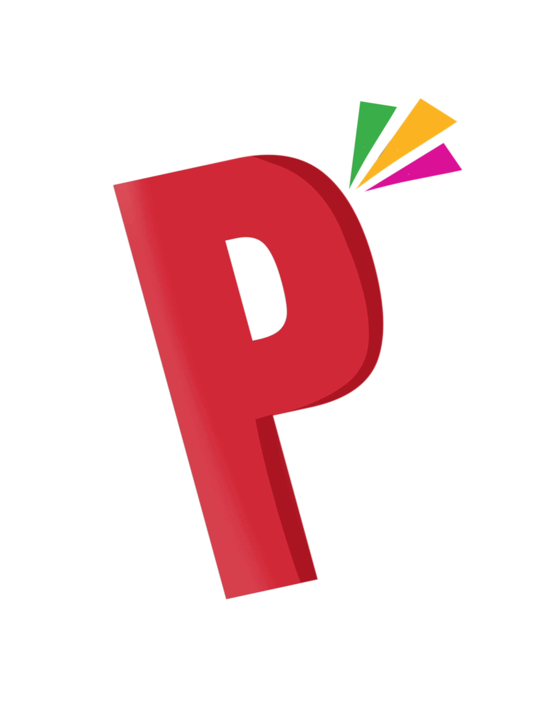
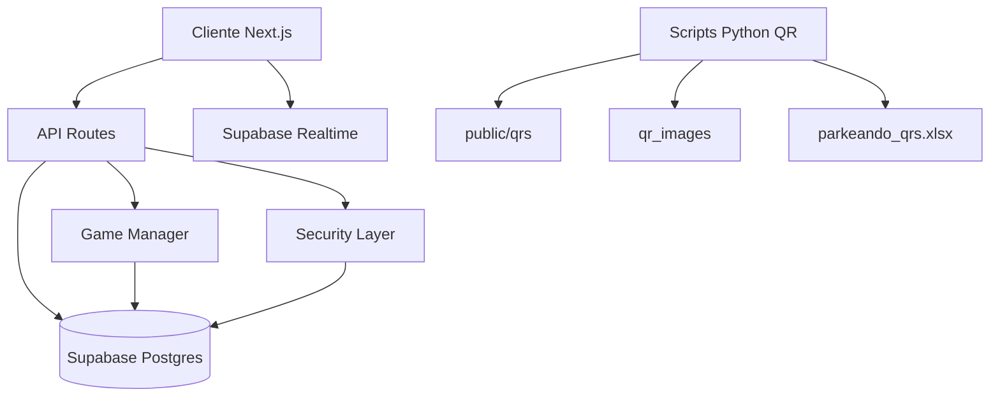
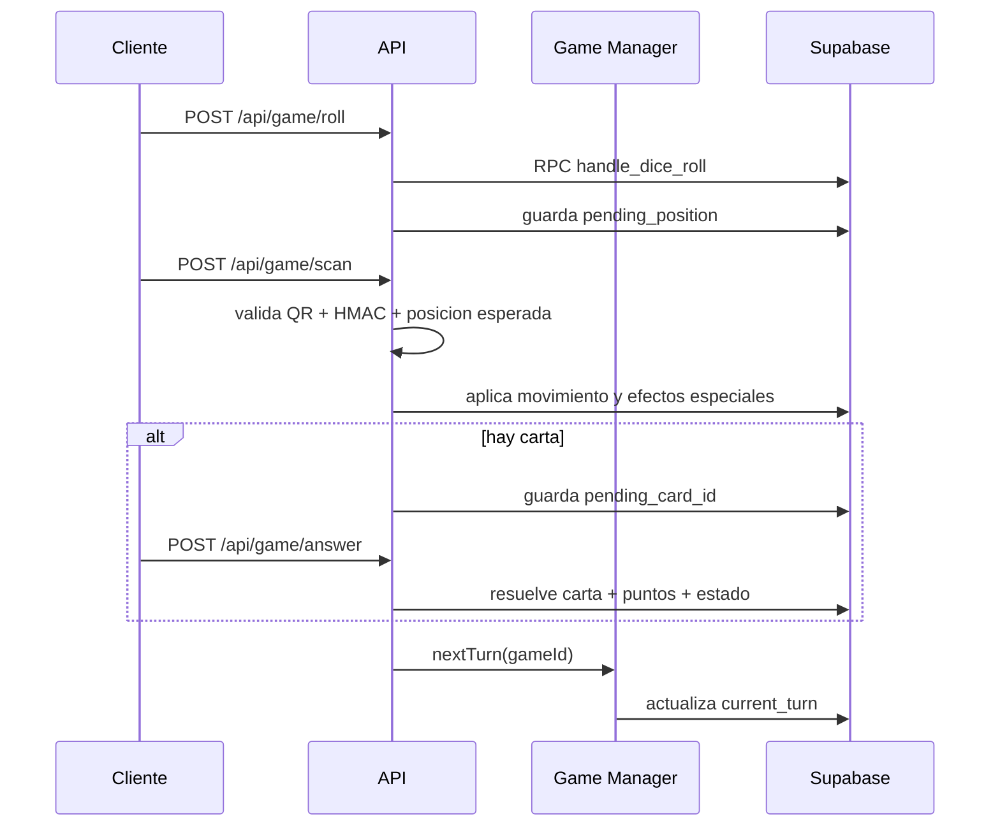

<p align="center">
  
</p>

<h1 align="center">Parkeando Edicion Universitaria</h1>

<p align="center">
  Juego educativo multijugador (tablero fisico + app web) para aprender cultura, turismo y gastronomia de Panama.
</p>

<p align="center">
  
  
  
  
  
  
</p>

<p align="center">
  
  
  
  
  
  
</p>

---

## Resumen

Parkeando combina un tablero fisico con codigos QR y una aplicacion web en tiempo real.

Estado actual (abril 2026):

- Tablero de 120 casillas.
- QRs escaneables de juego: 1 a 120.
- Flujo multijugador 2 a 6 jugadores activos por partida.
- Modo espectador para partidas en curso.
- Turnos, timeout, AFK y limpieza automatica por cron/heartbeat.
- Shop de personalizacion (avatares, bordes, titulos).
- Dashboard admin con moderacion, seguridad y analitica.
- Privacidad y derechos ARCO (Ley 81 de 2019 - Panama).

---

## Stack y arquitectura

### Tecnologias

- Frontend: Next.js App Router, React, TypeScript, Tailwind CSS, Framer Motion, Zustand.
- Backend: Next.js Route Handlers (API), Supabase (Postgres + Realtime + RPC).
- Seguridad: JWT, refresh token en cookie httpOnly, bcrypt, hCaptcha, CSP, rate limiting.
- Utilidades: Zod, validator, pg/postgres, scripts Python para QR.

### Vista de arquitectura



---

## Como funciona una partida

1. Usuario se registra/inicia sesion.
2. Entra a lobby y se une/crea partida.
3. Marca Ready.
4. Cuando todos estan listos, inicia countdown (10s) y comienza la partida.
5. Turno del jugador:
   - Lanza dados.
   - El servidor fija posicion pendiente.
   - Escanea QR de la casilla esperada.
   - Se aplican casillas especiales y/o carta (pregunta/reto/premio/penalizacion).
   - Se actualiza posicion/puntos/estado.
   - Si no hay turno extra, pasa al siguiente.
6. Fin cuando alguien llega a meta (120) o por cierre administrativo/condicion de permanencia.

### Casillas y reglas importantes

- Inicio: 0.
- Meta: 120.
- Eventos nacionales: otorgan bonus.
- Viaje rapido: teletransporte (por ejemplo casilla 85 a 112).
- Penalizaciones: pueden saltar turno o afectar avance.
- Batalla Juega Vivo: cuando varios coinciden en casilla, uno avanza y otros pierden turno.

---

## Flujo backend del turno



Notas de robustez implementadas:

- `nextTurn` se ejecuta por `gameId` (evita errores entre partidas).
- Turn timeout y AFK separados para no expulsar indebidamente.
- Si hay `skip_turns_remaining`, se consume penalizacion antes de marcar AFK.
- Espectadores redirigen rapidamente cuando la partida finaliza.

---

## APIs principales

### Auth

| Endpoint | Metodo | Descripcion |
| --- | --- | --- |
| /api/auth/register | POST | Registro con hCaptcha, validaciones y consentimiento |
| /api/auth/login | POST | Login con rate limit, lockout y refresh cookie |
| /api/auth/refresh | POST | Renueva access token con refresh token |
| /api/auth/logout | POST | Cierre de sesion |

### Juego

| Endpoint | Metodo | Descripcion |
| --- | --- | --- |
| /api/game/create | POST | Crea partida y agrega anfitrion |
| /api/game/join | POST | Une jugador o asigna modo espectador |
| /api/game/ready | POST | Toggle ready en lobby |
| /api/game/start | POST | Inicia partida tras countdown y validacion |
| /api/game/roll | POST | Tirada de dado y reglas de turno |
| /api/game/scan | POST | Valida QR autenticado y aplica movimiento |
| /api/game/answer | POST | Resuelve carta y transiciona turno |
| /api/game/timeout | POST | Procesa timeout/afk/camara rechazada |
| /api/game/leave | POST | Salida de waiting o abandono en curso |
| /api/game/check | GET | Estado liviano de partida (fallback realtime) |
| /api/game/spectate | POST/DELETE | Entrar/salir de modo espectador |
| /api/game/heartbeat | POST | Heartbeat de jugador en partida |
| /api/game/monitor | GET/POST | Mantenimiento por cron (protegido) |
| /api/game/queue/cleanup | POST | Limpieza de cola ready (protegido) |

### Comunidad y ranking

| Endpoint | Metodo | Descripcion |
| --- | --- | --- |
| /api/scoreboard | GET | Top publico (cacheado) |
| /api/leaderboard | GET | Leaderboard extendido |
| /api/game/chat | GET/POST | Chat de partida |

### Tienda

| Endpoint | Metodo | Descripcion |
| --- | --- | --- |
| /api/shop | GET | Catalogo, inventario, balance |
| /api/shop | POST | Compra item |
| /api/shop/equip | POST | Equipar o desequipar |

### Admin y privacidad

| Endpoint | Metodo | Descripcion |
| --- | --- | --- |
| /api/admin/stats | GET | KPI globales y del dia |
| /api/admin/games | GET | Listado de partidas |
| /api/admin/games/[id]/end | POST | Finaliza mesa |
| /api/admin/games/[id]/reset | POST | Reinicia mesa |
| /api/admin/users | GET | Gestion de usuarios |
| /api/privacy/my-data | GET | Export de datos personales |
| /api/privacy/data-deletion | POST | Solicitud de eliminacion |

---

## Pantallas y rutas

- Home: `/`
- Auth: `/auth`, `/auth/login`, `/auth/register`
- Lobby: `/lobby`
- Juego: `/game/play` (y `?spectate=<gameId>`)
- Scoreboard: `/scoreboard`
- Shop: `/shop`
- Admin: `/admin/dashboard`
- Informativas: `/rules`, `/about`, `/privacy`, `/terms`
- QA interno: `/test/ruleta`, `/test/qr-upload`, `/test/preguntas`

---

## Variables de entorno

Basado en `.env.example` y referencias de runtime.

### Requeridas

| Variable | Uso |
| --- | --- |
| NEXT_PUBLIC_APP_URL | URL publica base de la app |
| NEXT_PUBLIC_SUPABASE_URL | Endpoint Supabase |
| NEXT_PUBLIC_SUPABASE_ANON_KEY | Key publica cliente |
| SUPABASE_SERVICE_ROLE_KEY | Key server para tareas privilegiadas |
| JWT_SECRET | Firma access tokens |
| JWT_REFRESH_SECRET | Firma refresh tokens |
| QR_SECRET | Firma HMAC de codigos QR |
| NEXT_PUBLIC_HCAPTCHA_SITE_KEY | hCaptcha frontend |
| HCAPTCHA_SECRET_KEY | hCaptcha backend |
| SUPER_ADMIN_EMAIL | Cuenta superadmin |

### Operativas / opcionales

| Variable | Uso |
| --- | --- |
| CRON_SECRET | Autoriza `/api/game/monitor` y `/api/game/queue/cleanup` |
| DB_ENCRYPTION_KEY | Soporte de cifrado (seguridad y scripts) |
| DATABASE_URL | Ruta dev de `/api/admin/migrate` |
| SUPABASE_DB_URL | Conexion directa Postgres para scripts externos |
| FORMSUBMIT_DELETION_ENDPOINT | Endpoint para solicitudes de eliminacion |
| FORMSUBMIT_DELETION_CC | Copias internas de privacidad |
| SOCKET_CORS_ORIGINS | Origenes permitidos para websocket/socket |
| ADMIN_EMAIL / ADMIN_PASSWORD | Compatibilidad con scripts de bootstrap admin |
| NEXT_PUBLIC_SITE_URL / APP_URL / SITE_URL | URLs fallback en reportes |

---

## Generacion de QRs

Script principal: `scripts/generate_qr.py`

Genera:

- `public/qrs/cell_00.png` a `public/qrs/cell_120.png`
- `qr_images/qr_000_...png` a `qr_images/qr_120_...png`
- `parkeando_qrs.xlsx` (control e impresion)

Comandos:

```bash
pip install -r scripts/requirements.txt
python scripts/generate_qr.py
```

El payload QR se firma con HMAC SHA-256 usando `QR_SECRET`.

Formato validado en backend:

```text
PARKEANDO:{cellNumber}:{hasQuestion}:{hmac}
```

---

## Seguridad

- JWT access + refresh token en cookie httpOnly.
- Contrasenas con bcrypt.
- hCaptcha en registro y solicitudes sensibles.
- Rate limit por endpoint e IP.
- Content Security Policy por `src/proxy.ts`.
- Validacion y sanitizacion con Zod/validator.
- Verificacion de autenticidad QR con HMAC y comparacion timing-safe.
- Lockout por intentos de login fallidos.
- Eventos y trazabilidad en `game_events` y `login_attempts`.

---

## Panel administrativo

Ruta: `/admin/dashboard`

Incluye:

- Resumen de usuarios, partidas y actividad.
- Control de mesas activas e historial.
- Gestion de usuarios y seguridad (intentos de login, IP info).
- Moderacion de chat (eventos y baneos).
- Exportaciones y utilidades operativas.

---

## Assets para interfaz

Coleccion incluida en el repo para UI del juego y del README.

### Dados

<p>
  
  
  
  
  
  
</p>

### Iconografia Panama (muestra)

<p>
  
  
  
  
</p>

Creditos: https://www.flaticon.es/packs/panama-3

Adicionalmente:

- `public/fonts/` contiene fuentes personalizadas.
- `public/balboa-coin.svg` y `public/balboa-shop-coin.svg` para economia in-game.

---

## Estructura del repositorio

```text
parkeando-game/
|- src/
|  |- app/                    # Rutas web y API (App Router)
|  |- components/             # Componentes UI y de juego
|  |- lib/                    # Reglas, managers, seguridad, utilidades
|  |- data/                   # Cartas y contenido estatico
|  |- store/                  # Estado cliente (Zustand)
|  |- types/                  # Tipos TypeScript
|- public/                    # Assets estaticos (logo, dados, iconos)
|- scripts/                   # Scripts operativos y diagnostico
|- qr_images/                 # Export de QRs para impresion
```

## Creditos

Proyecto academico para la Universidad Interamericana de Panama.
